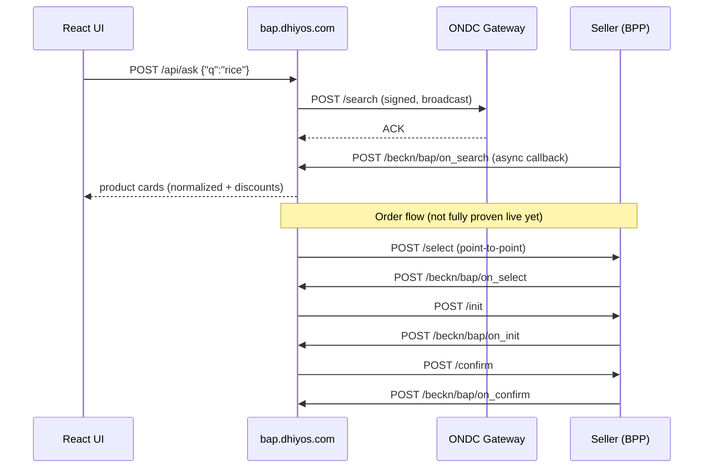

# Dhiyos — ONDC Buyer App (BAP)

Dhiyos is a consumer commerce platform that acts as a **Buyer Network Participant (BAP)** on [ONDC](https://ondc.org) pre-production. It discovers products from real network sellers via the Beckn protocol, applies Dhiyos card-reward logic, and can drive the order flow (select → init → confirm).

| | |
|---|---|
| **Live pre-prod backend** | https://bap.dhiyos.com |
| **Subscriber ID** | `bap.dhiyos.com` |
| **Domain** | `ONDC:RET10` (retail grocery) |
| **Org repo** | https://github.com/Tech-Dhiyos/dhiyos-ondc |

This monorepo contains the **Express backend** (ONDC + API) and a **React chat UI** (Vite). Only the backend is deployed today; the UI runs locally.

---

## Where the project was left (read this first)

**Last verified working (July 2026):** Gateway search on pre-prod returns real seller responses after the ONDC gateway upgrade fix (core 1.2.5 + retail fulfillment block).

| Area | Status | Notes |
|---|---|---|
| ONDC registration | Done | Subscribed on pre-prod portal; keys on EC2 |
| Live backend deploy | Done | `bap.dhiyos.com` on AWS EC2 (Mumbai), nginx + Let's Encrypt |
| Gateway search | Working | `POST /beckn/debug/search` → real BPPs respond |
| Inbound callbacks | Working | Sellers POST `on_search` etc. to `/beckn/bap/on_*` |
| Praan certification | Blocked | Mock seller `pramaan.ondc.org` never responds — ONDC support ticket needed |
| React chat UI deploy | Not started | UI runs at `localhost:5173` only; no `app.dhiyos.com` yet |
| UI → live ONDC | Partial | `/api/ask` calls network search via `discover()`, but UI is not deployed against live backend |
| Full live order flow | Not proven | `select → init → confirm` coded in `server/beckn/order.js`; tested with mock BPP, not end-to-end on real sellers |
| OpenAI on EC2 | Off | `OPENAI_API_KEY` not set on server — chat/recipe endpoints return 503 there |
| Stripe / AP2 checkout | Local only | Works locally with test keys; not wired on EC2 |
| Production ONDC | Not yet | Production cutover target was July 27, 2026 — still on pre-prod |

**If you're a new contributor:** start with local dev (`BECKN_ENABLED=false`), read the architecture below, then pick something from [Contributing](#contributing).

---

## Quick start (local dev)

**Requirements:** Node.js 20+, npm

```bash
git clone https://github.com/Tech-Dhiyos/dhiyos-ondc.git
cd dhiyos-ondc
cp .env.example .env
npm install
npm run seed
npm run dev
```

| URL | What |
|---|---|
| http://localhost:5173 | React chat UI |
| http://localhost:8787/beckn/health | ONDC diagnostics |
| http://localhost:8787/mock-bpp | Local mock seller (when `BECKN_ENABLED=false`) |

With default settings (`BECKN_ENABLED=false`), search talks to the in-process mock seller — no ONDC registration needed.

---

## Architecture overview

Dhiyos is three layers stacked on top of each other:

1. **ONDC / Beckn layer** — talks to the open network (search, order, callbacks)
2. **Commerce intelligence layer** — GPT routing, card discounts, recommendations
3. **Payments layer** — Stripe off-session charges + AP2 signed mandates

The React UI is a thin client that calls the Express API. Vite proxies `/api/*` to port 8787 in dev.

```
┌─────────────────────────────────────────────────────────────────┐
│  React UI (src/)          localhost:5173  [NOT DEPLOYED YET]    │
│  ChatPage → ProductCarousel, Cart, Stripe card auth             │
└───────────────────────────────┬─────────────────────────────────┘
                                │ POST /api/ask, /api/book, ...
                                ▼
┌─────────────────────────────────────────────────────────────────┐
│  Express server (server/index.js)         port 8787             │
│  ┌─────────────┐  ┌──────────────┐  ┌─────────────────────────┐ │
│  │ /api/*      │  │ /beckn/*     │  │ SQLite (server/dhiyos.db)│ │
│  │ chat, ask,  │  │ health,      │  │ products, offers, cards, │ │
│  │ book, stripe│  │ debug, BAP   │  │ orders, user_payment     │ │
│  └──────┬──────┘  │ callbacks    │  └─────────────────────────┘ │
│         │         └──────┬───────┘                              │
│         ▼                ▼                                      │
│  tools/ + catalog    beckn/ (see below)                         │
└───────────────────────────────┬─────────────────────────────────┘
                                │
          BECKN_ENABLED=true    │    BECKN_ENABLED=false
                ┌───────────────┴───────────────┐
                ▼                               ▼
   ONDC Pre-prod Gateway                 mock-bpp/ (in-process)
   preprod.gateway.ondc.org              simulates a seller locally
                │
                ▼
        Real seller apps (BPPs)
        e.g. preprod-jajee-bpp.shopalyst.com
```

---

## ONDC network architecture

Dhiyos is **BAP only** — we do not store or sell goods. We discover what sellers offer and can place orders on their BPPs.



### Actors

| Actor | What it is | Dhiyos example |
|---|---|---|
| **BAP** | Buyer app (us) | `bap.dhiyos.com` |
| **BPP** | Seller app | `preprod-jajee-bpp.shopalyst.com` |
| **Gateway** | Broadcasts search to many BPPs | `https://preprod.gateway.ondc.org` |
| **Registry** | Identity, keys, subscription | `https://preprod.registry.ondc.org/ondc` |

### Beckn message shape

Every Beckn call is an envelope:

```json
{
  "context": { "domain", "action", "bap_id", "transaction_id", "message_id", ... },
  "message": { ... payload ... }
}
```

- **`transaction_id`** — one shopping session (search through confirm share it)
- **`message_id`** — one specific request; used to match async callbacks

### Search flow (working on pre-prod)

1. `server/beckn/bap.js` → `search()` builds intent via `search-intent.js` (item + **fulfillment** with GPS/pincode + buyer finder fee)
2. Signed POST to gateway `/search` (or point-to-point if `bppId`/`bppUri` set)
3. Gateway ACKs immediately; sellers respond asynchronously
4. `server/beckn/routes.js` receives `on_search` at `/beckn/bap/on_search`
5. `server/beckn/store.js` correlates by `message_id` (in-memory — **must stay single-process on EC2**)
6. `server/beckn/normalize.js` merges catalogs into flat product objects
7. `server/beckn/discovery.js` applies card discount overlay

### Order flow (coded, not fully proven live)

1. `server/beckn/order.js` → `placeNetworkOrders(cart)` groups cart items by seller
2. For each group: `select` → `init` → `confirm` (point-to-point to BPP)
3. Called from `server/tools/book.js` before Stripe/AP2 payment
4. Cart items need Beckn IDs attached (`bpp_id`, `bpp_uri`, `item_id`, `provider_id`, `fulfillment_id`) — `normalize.js` sets these from `on_search`

### Identity & security

| File | Role |
|---|---|
| `server/beckn/keys.js` | Ed25519 signing + X25519 encryption keypair (from ONDC portal) |
| `server/beckn/auth.js` | BLAKE2b digest + Authorization header signing/verification |
| `server/beckn/registry.js` | Subscribe payload, challenge decrypt, registry key lookup |
| `server/beckn/routes.js` | Serves `ondc-site-verification.html`, `/on_subscribe` challenge |

On EC2: `BECKN_SKIP_INBOUND_VERIFY=true` bypasses registry lookup failures on inbound callbacks (pre-prod workaround).

---

## Backend modules (file map)

```
server/
├── index.js                 Main Express app — mounts all routes
├── db.js                    SQLite schema (products, offers, orders, payments)
├── catalog.js               Read categories, offers, card names from DB
├── seed.js                  Populate local SQLite with demo products/offers
├── payments.js              Stripe SetupIntent, off-session charges
├── ap2.js                   AP2 mandate signing (intent, cart, payment, receipt)
│
├── beckn/
│   ├── config.js            All ONDC env vars (gateway URL, domain, timeouts)
│   ├── context.js           Build Beckn context block for outgoing calls
│   ├── bap.js               Outgoing: search, select, init, confirm, status
│   ├── search-intent.js     RET10 search payload builder (fulfillment + payment)
│   ├── routes.js            Inbound callbacks + onboarding routes
│   ├── store.js             In-memory message_id → callback correlation
│   ├── discovery.js         search() + normalize + card discount overlay
│   ├── normalize.js         on_search catalogs → product card shape
│   ├── order.js             select → init → confirm per seller group
│   ├── auth.js              Sign/verify Authorization headers
│   ├── keys.js              Load/persist Ed25519 + X25519 keys
│   ├── registry.js          ONDC registry subscribe + key lookup
│   ├── onboarding.js        CLI tool: npm run beckn:onboard
│   └── mock-bpp/            Dev-only fake seller (when BECKN_ENABLED=false)
│       ├── index.js         Express router answering Beckn actions
│       └── catalog.js       Hardcoded products for local loop testing
│
└── tools/
    ├── discount.js          Pure fn: match user cards → best discount on price
    ├── recommend.js         pickBest(): cheapest product clearing quality bar
    └── book.js              bookCart(): ONDC order + AP2 mandates + Stripe charge
```

---

## API routes

### Chat & commerce (`/api/*`)

| Method | Path | Purpose | Needs OpenAI? |
|---|---|---|---|
| POST | `/api/chat` | Generic GPT chat | Yes |
| POST | `/api/ask` | Main agent: route → search → recommend / recipe / book | Yes |
| POST | `/api/discount` | Compute card discount for a price | No |
| POST | `/api/setup-intent` | Stripe card authorization (SetupIntent) | Stripe keys |
| POST | `/api/payment-method` | Save authorized card to SQLite | Stripe keys |
| GET | `/api/payment-status` | Is a card authorized? | No |
| POST | `/api/book` | Direct cart booking (AP2 + Stripe + ONDC) | Stripe keys |

### `/api/ask` routing logic

GPT classifies the user message into one of:

| Route | Trigger | What happens |
|---|---|---|
| **book** | "Book my cart", "checkout" | `bookCart()` → ONDC order + AP2 + Stripe |
| **recipe** | "Ingredients for paneer butter masala" | Decompose dish → search each ingredient category |
| **products** | "Show me rice", "Tomato 1kg" | Network search → discount overlay → recommend best |
| **text** | General chat | Plain GPT reply |

### ONDC / Beckn (`/beckn/*`)

| Method | Path | Purpose |
|---|---|---|
| GET | `/beckn/health` | Config + key status (no secrets) |
| POST | `/beckn/debug/search` | Trigger gateway search in-process (`{"q":"rice"}`) |
| POST | `/beckn/debug/pramaan-search` | Praan cert helper (direct + broadcast to mock seller) |
| POST | `/beckn/bap/on_search` | Inbound seller catalog callback |
| POST | `/beckn/bap/on_select` | Inbound select response |
| POST | `/beckn/bap/on_init` | Inbound init response |
| POST | `/beckn/bap/on_confirm` | Inbound confirm response |
| POST | `/beckn/bap/on_status` | Inbound status update |
| POST | `/beckn/bap/on_subscribe` | Registry onboarding challenge |
| GET | `/ondc-site-verification.html` | ONDC domain verification |

---

## Frontend architecture

```
src/
├── main.jsx                 React entry + router
├── pages/
│   └── ChatPage.jsx         Main chat surface (messages, input, suggestions)
└── components/
    ├── ProductCarousel.jsx  Horizontal product cards from /api/ask
    ├── ProductCard.jsx      Single product + "Add to cart"
    ├── RecipeResult.jsx     Multi-ingredient recipe layout
    ├── CartButton.jsx       Cart badge
    ├── CartModal.jsx        Cart contents + checkout trigger
    ├── BookingReceipt.jsx   AP2 receipt after successful book
    ├── CardAuthorization.jsx Stripe SetupIntent flow
    ├── UserAccount.jsx      Card picker (which cards user "has")
    └── data/cards.js        Demo card definitions
```

**Data flow:** `ChatPage` → `POST /api/ask` with `{ messages, userCards, cart }` → renders product carousel / recipe / booking receipt based on `type` in response.

**Dev proxy:** Vite forwards `/api/*` to `http://localhost:8787` (see `vite.config.js`). The UI never talks to ONDC directly.

---

## Booking & payments flow

When the user says "Book my cart":

```
1. bookCart() in server/tools/book.js
2. ├── placeNetworkOrders(cart)     Beckn select→init→confirm per seller [best-effort]
3. ├── createIntentMandate()        AP2: user intent to purchase
4. ├── createCartMandate()          AP2: per-merchant cart snapshot (signed JWS)
5. ├── createPaymentMandate()       AP2: payment authorization
6. ├── chargeMerchant()             Stripe off-session charge per merchant
7. └── createPaymentReceipt()       AP2: signed receipt returned to UI
```

Money movement is **Stripe** (real charges in test mode locally). ONDC order placement is **best-effort** — a network failure is recorded per seller group but does not block payment today.

---

## Local vs live modes

| Setting | Behavior |
|---|---|
| `BECKN_ENABLED=false` | Search goes to `localhost:8787/mock-bpp` — full loop works offline |
| `BECKN_ENABLED=true` | Search goes to ONDC gateway; callbacks must reach your public URL |
| No `OPENAI_API_KEY` | Server boots; `/api/ask` and `/api/chat` return 503 |
| No Stripe keys | Booking endpoints return errors; discovery/search still work |

---

## Deployment architecture (EC2)

```
Internet
   │
   ▼
GoDaddy DNS: bap.dhiyos.com → Elastic IP (13.207.135.218)
   │
   ▼
nginx (443, Let's Encrypt)
   │
   ▼
systemd service "dhiyos" → node server/index.js (port 8787)
   │
   ├── /opt/dhiyos/ondc_backend/.env
   └── /opt/dhiyos/ondc_backend/server/beckn-keys.json
```

Provisioned via `scripts/ec2-setup.sh`. Full steps in **[docs/deploy-aws-ec2.md](docs/deploy-aws-ec2.md)**.

**Important constraints on EC2:**
- Single Node process (in-memory callback store in `store.js`)
- No OpenAI key configured (chat disabled on server)
- No frontend deployed — only ONDC backend is public

---

## Environment variables

Copy `.env.example` → `.env`. Secrets are git-ignored.

| Variable | Purpose |
|---|---|
| `BECKN_ENABLED` | `false` = local mock seller; `true` = live ONDC pre-prod |
| `BAP_ID` / `BAP_URI` | Network identity (`bap.dhiyos.com`) |
| `ONDC_GATEWAY_URL` | `https://preprod.gateway.ondc.org` |
| `ONDC_REGISTRY_URL` | `https://preprod.registry.ondc.org/ondc` |
| `ONDC_CORE_VERSION` | `1.2.5` (required after July 2026 gateway upgrade) |
| `ONDC_ENCRYPTION_PUBLIC_KEY` | From ONDC portal |
| `ONDC_SEARCH_GPS` / `ONDC_SEARCH_PINCODE` | Optional delivery location override |
| `BECKN_SKIP_INBOUND_VERIFY` | `true` on EC2 pre-prod (registry lookup workaround) |
| `server/beckn-keys.json` | Ed25519/X25519 keypair from ONDC portal |

For cloud deploys without a keys file, set `BECKN_KEYS_JSON` to the full JSON contents.

---

## Verify live search

```bash
curl -s -X POST https://bap.dhiyos.com/beckn/debug/search \
  -H 'Content-Type: application/json' -d '{"q":"rice"}'
```

Expect `responseCount > 0` and real `bppIds` (e.g. `preprod-jajee-bpp.shopalyst.com`).

---

## npm scripts

| Script | Description |
|---|---|
| `npm run dev` | Backend + frontend concurrently |
| `npm run dev:server` | Express only |
| `npm run dev:client` | Vite UI only |
| `npm run seed` | Populate local SQLite catalog |
| `npm start` | Production server |
| `npm run beckn:onboard` | CLI registry subscribe (usually done via portal) |
| `npm run build` | Build React UI to `dist/` |

---

## Known issues & blockers

| Issue | Impact | Next step |
|---|---|---|
| Praan mock seller silent | Cannot complete Flow 1A certification | Email techsupport@ondc.org — subject `[Gateway & Registry Upgrade]`, subscriber `bap.dhiyos.com` |
| Frontend not deployed | No public demo for stakeholders | Deploy Vite build to `app.dhiyos.com` or integrate with `dhiyos-FE` repo |
| OpenAI off on EC2 | `/api/ask` 503 on live server | Add `OPENAI_API_KEY` to EC2 `.env` when ready |
| In-memory callback store | Cannot horizontally scale or use serverless | Acceptable for single EC2; would need Redis for multi-instance |
| Live order not proven | select/init/confirm untested against real BPPs | Pick one seller from search, run full cart checkout locally with `BECKN_ENABLED=true` |

---

## Contributing

1. **Branch** off `main`: `git checkout -b feature/your-change`
2. **Run locally** with mock BPP first (`BECKN_ENABLED=false`)
3. **Keep secrets out of git** — `.env`, `*.db`, `server/beckn-keys.json` are ignored
4. **Open a PR** to `main` in [Tech-Dhiyos/dhiyos-ondc](https://github.com/Tech-Dhiyos/dhiyos-ondc)

### Good first tasks

- Wire deployed frontend to `https://bap.dhiyos.com/api/ask`
- End-to-end order against one real BPP from search results
- Tests for `search-intent.js`, `normalize.js`, `discount.js`
- Deploy React UI to `app.dhiyos.com`
- Praan Flow 1A certification once mock seller responds

### Glossary

| Term | Meaning |
|---|---|
| **Pre-prod** | ONDC test network (safe to break) |
| **Production** | Live ONDC network |
| **BAP** | Buyer app (this repo) |
| **BPP** | Seller app |
| **Beckn** | Protocol / message format ONDC uses |
| **AP2** | Agentic Protocol 2 — signed payment mandates |
| **Praan / Pramaan** | ONDC certification test harness |
| **RET10** | ONDC retail domain for grocery |
| **std:080** | City code for Bangalore |

---

## Related repos

| Repo | Purpose |
|---|---|
| [Tech-Dhiyos/dhiyos-FE](https://github.com/Tech-Dhiyos/dhiyos-FE) | Frontend (separate; this repo also has a Vite UI) |
| [Tech-Dhiyos/dhiyos-ML](https://github.com/Tech-Dhiyos/dhiyos-ML) | ML services |
| [Tech-Dhiyos/dhiyos-BE](https://github.com/Tech-Dhiyos/dhiyos-BE) | Legacy placeholder — use **dhiyos-ondc** instead |

---

## Support / ONDC issues

Email **techsupport@ondc.org** with subject `[Gateway & Registry Upgrade]` and subscriber ID `bap.dhiyos.com`.

---

## License

Private — Dhiyos / Tech-Dhiyos. Contact the team before external use.
